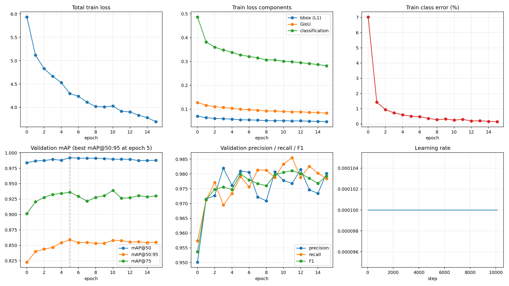
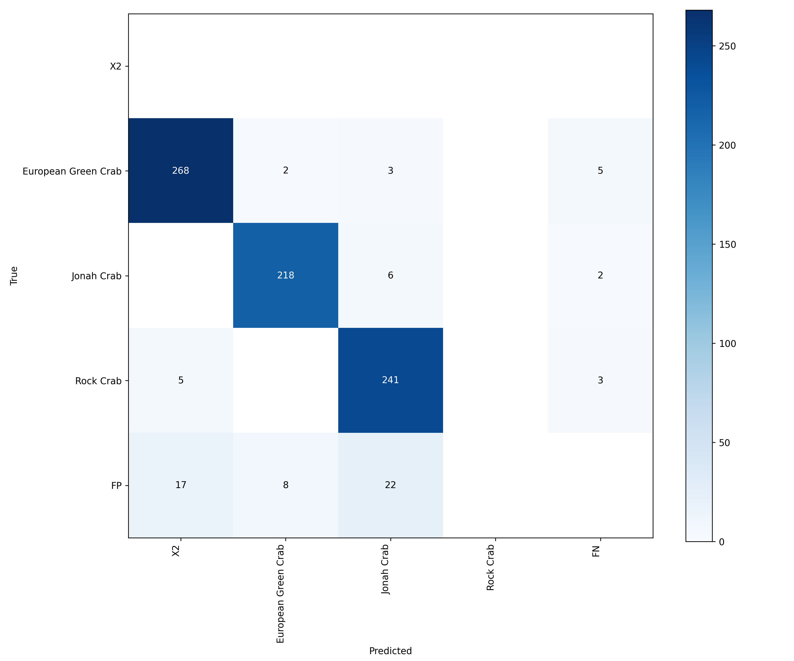

# Multi-Species Crab Detection with RF-DETR Medium

Automated object detection and multi-class identification system for three crab species: **European Green Crab**, **Rock Crab**, and **Jonah Crab**. Trained using the `RFDETRMedium` transformer architecture on a merged multi-source dataset on Kaggle.

---

## Model Performance & Evaluation

### Benchmark Summary

| Checkpoint | Split | mAP@50 | mAP@50:95 | mAP@75 |
| :--- | :--- | :--- | :--- | :--- |
| **checkpoint_best_total** | **Valid** | **0.9922** | **0.8600** | **0.9348** |
| **checkpoint_best_total** | **Test** | **0.9834** | **0.8147** | **0.8910** |
| last_ema | Valid | 0.9877 | 0.8558 | 0.9322 |
| last_ema | Test | 0.9786 | 0.8178 | 0.8879 |

---

### Training & Validation Progression

The model was trained for 15 epochs, reaching optimal bounding box precision at epoch 5 before early convergence[cite: 7].

[cite: 7]

---

### Confusion Matrices (Raw Counts)

Evaluated with confidence threshold $\ge 0.30$ and IoU threshold $\ge 0.50$. The matrices display true positives along the diagonal, cross-species confusion in off-diagonal cells, background false positives (`FP`), and missed crabs (`FN`)[cite: 5, 6].

| Validation Split (578 Images)[cite: 13] | Test Split (289 Images)[cite: 13] |
| :---: | :---: |
| [cite: 5] | [cite: 6] |

---

## Dataset Overview

The dataset was constructed by aggregating five open-source datasets into a consolidated COCO-format collection[cite: 10, 13]:

* **Base Dataset Images:** 2,889 images with 6,630 annotated objects (2.3 annotations/image average)[cite: 10, 11].
* **Base Object Distribution:** 2,405 single-object images[cite: 9], 120 images with 2–5 objects[cite: 9], and 447 multi-object scenes[cite: 9].
* **Dimensions:** 81.8% medium-resolution images[cite: 12], median resolution $386 \times 342$[cite: 10, 11].

### Class Distribution (Base Split)

| Class Name | Train Annotations | Valid Annotations | Test Annotations | Total Count |
| :--- | :--- | :--- | :--- | :--- |
| **European Green Crab** | 1,780 | 500 | 277 | **2,557** |
| **Rock Crab** | 1,538 | 417 | 249 | **2,204** |
| **Jonah Crab** | 1,285 | 358 | 226 | **1,869** |

---

## Preprocessing & Data Augmentation

To avoid overfitting and improve generalization across unseen marine environments, a 5× training augmentation pipeline was applied[cite: 13]:

* **Preprocessing:** Auto-orientation and white-padded resizing to $576 \times 576$ pixels[cite: 13].
* **Rotations:** Random rotation between -15° and +15°[cite: 13].
* **Photometric Distortions:** Brightness ($\pm 15\%$) and exposure ($\pm 15\%$) adjustments[cite: 13].
* **Sensor Noise & Artifacts:** Up to 2% random pixel noise and 20px directional motion blur (45° angle)[cite: 13].

**Augmented Dataset Distribution:**
* **Train Set:** 10,110 images (92%)[cite: 13]
* **Validation Set:** 578 images (5%)[cite: 13]
* **Test Set:** 289 images (3%)[cite: 13]
* **Total Volume:** 10,977 images[cite: 13]

---

## Training Configuration

* **Base Model:** `RFDETRMedium` with `dinov2_windowed_small` backbone[cite: 14]
* **Input Resolution:** $576 \times 576$ pixels[cite: 14]
* **Batch Strategy:** Batch size 4 with 4 gradient accumulation steps (effective batch size 16)[cite: 14]
* **Optimizer:** AdamW (`lr=1e-4`, `lr_encoder=1.5e-4`, `weight_decay=1e-4`)[cite: 14]
* **Early Stopping:** Patience of 10 epochs with minimum delta threshold 0.001[cite: 14]
* **Compute:** Kaggle GPU environment (~12 hours total execution time)

---

## Project Structure

```text
crab-detection-rfdetr/
├── assets/
│   ├── training_curves.png
│   ├── cm_best_total_valid_raw.png
│   └── cm_best_total_test_raw.png
├── configs/
│   └── training_config.json
├── src/
│   ├── train.py
│   ├── benchmark_quick.py
│   └── evaluate_full.py
├── .gitignore
├── README.md
└── requirements.txt